# 第一部分：基础操作评估（5 分）

本部分通过命令行与 NameNode Web UI 验证常见的 HDFS 操作流程，分为目录管理和批量操作两大任务。

## 任务 1：目录和文件管理

### 1.1 目录结构创建
- **目标**：在 `/user/student/project/` 下创建 `input/`、`output/`、`temp/` 子目录。
- **执行命令**：
  ```bash
  hdfs dfs -mkdir -p /user/student/project/input
  hdfs dfs -mkdir -p /user/student/project/output
  hdfs dfs -mkdir -p /user/student/project/temp
  ```
- **命令执行截图**：
  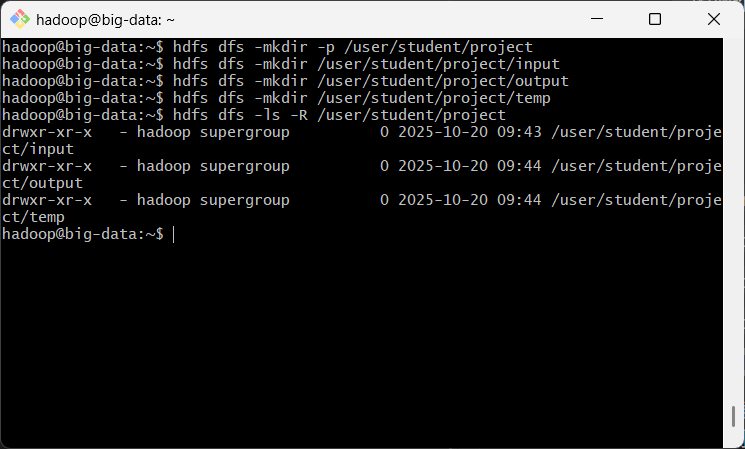
- **Web UI 验证**：
  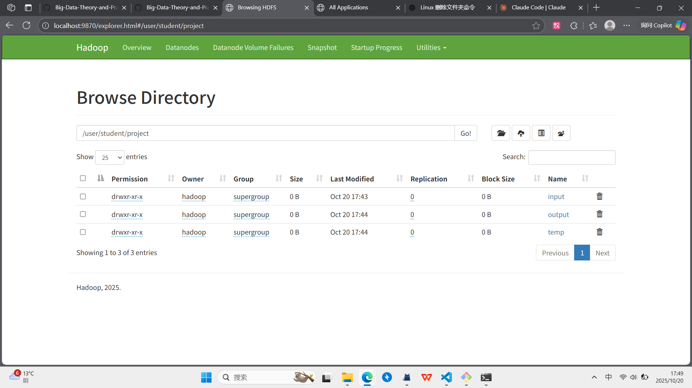

### 1.2 文件上传与查看
- **目标**：上传本地 `test.txt` 至 `input/` 目录，并查看文件内容与属性。
- **执行步骤**：
  ```bash
  # 创建包含 100 行内容的测试文件
  seq 1 100 | sed 's/^/第&行示例数据/' > test.txt

  # 上传到 HDFS
  hdfs dfs -put -f test.txt /user/student/project/input/

  # 查看头部与尾部内容
  hdfs dfs -cat /user/student/project/input/test.txt | head -n 10
  hdfs dfs -tail /user/student/project/input/test.txt

  # 查看文件属性
  hdfs dfs -stat "%n %b %o %y" /user/student/project/input/test.txt
  ```
- **命令执行截图**：
  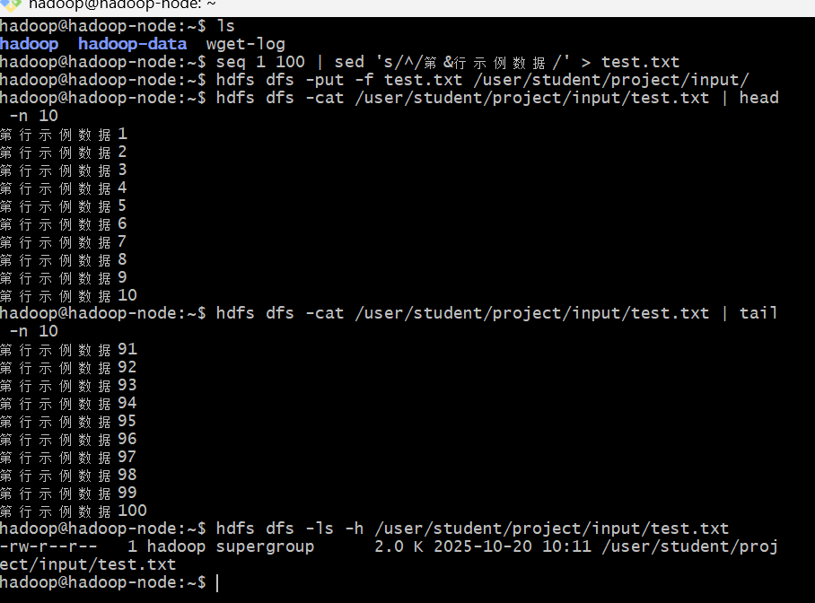
- **Web UI 验证**：
  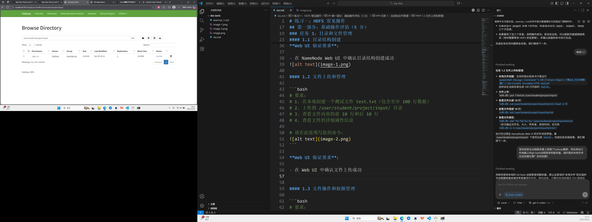

### 1.3 文件复制与权限管理
- **目标**：复制文件至 `temp/` 目录并调整文件与目录权限。
- **执行步骤**：
  ```bash
  hdfs dfs -cp /user/student/project/input/test.txt /user/student/project/temp/
  hdfs dfs -chmod 644 /user/student/project/temp/test.txt
  hdfs dfs -chmod 755 /user/student/project/temp
  hdfs dfs -ls -R /user/student/project/temp
  ```
- **命令执行截图**：
  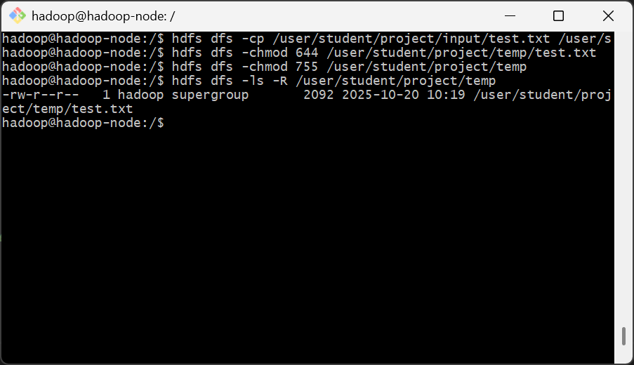
- **Web UI 验证**：
  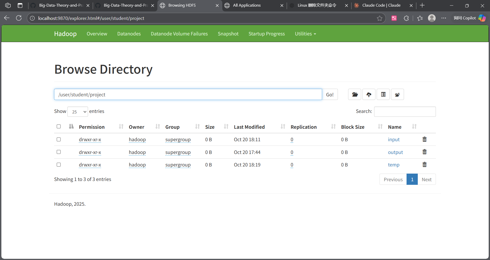
  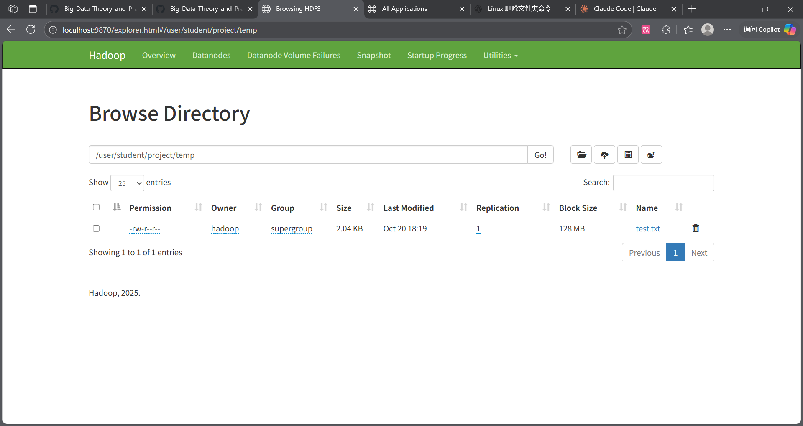

## 任务 2：批量操作

### 2.1 批量文件上传
- **目标**：批量创建并上传 `file1.txt` 至 `file5.txt`。
- **执行步骤**：
  ```bash
  for i in {1..5}; do echo "文件${i} 的示例内容" > file${i}.txt; done
  hdfs dfs -put -f file*.txt /user/student/project/input/
  hdfs dfs -ls /user/student/project/input/file*.txt
  ```
- **命令执行截图**：
  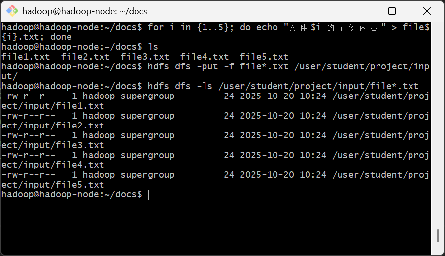
- **Web UI 验证**：
  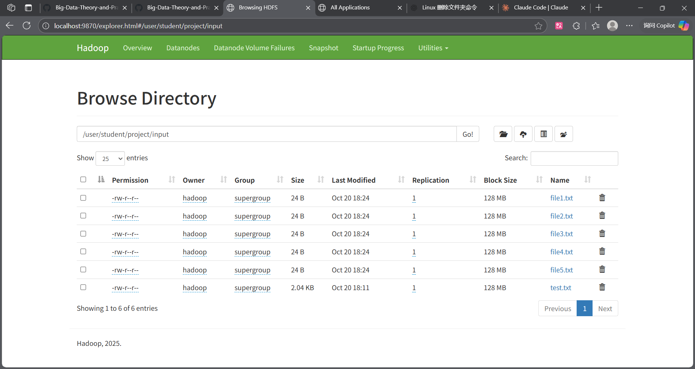

### 2.2 通配符操作
- **目标**：利用通配符批量列出、复制并统计文件。
- **执行步骤**：
  ```bash
  hdfs dfs -ls /user/student/project/input/*.txt
  hdfs dfs -cp /user/student/project/input/file*.txt /user/student/project/temp/
  hdfs dfs -count /user/student/project/input
  ```
- **命令执行截图**：
  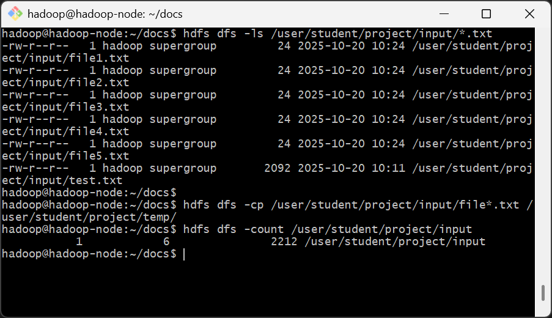
- **Web UI 验证**：
  

### 2.3 目录备份与清理
- **目标**：备份 `project/` 目录至 `backup/`，并清空 `temp/` 下文件。
- **执行步骤**：
  ```bash
  hdfs dfs -mkdir -p /user/student/backup
  hdfs dfs -cp -p /user/student/project /user/student/backup/
  hdfs dfs -rm -f /user/student/project/temp/*
  hdfs dfs -ls -R /user/student/backup/project
  hdfs dfs -ls /user/student/project/temp
  ```
- **命令执行截图**：
  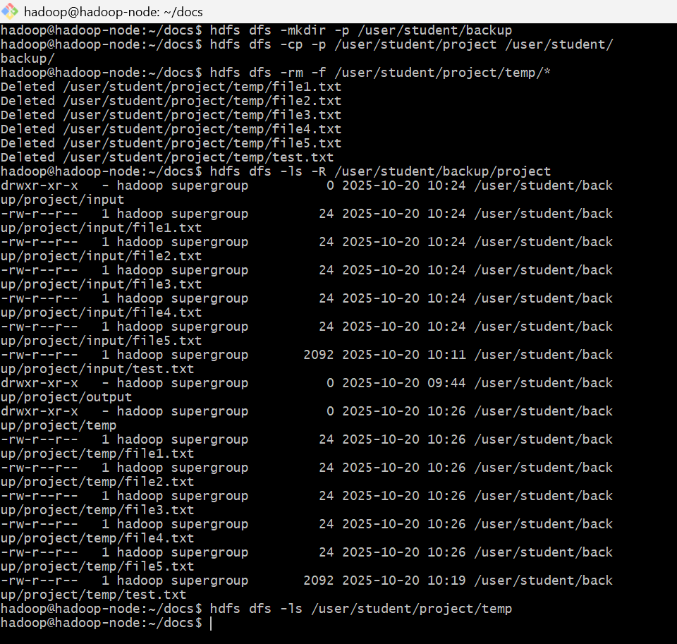
- **Web UI 验证**：
  
  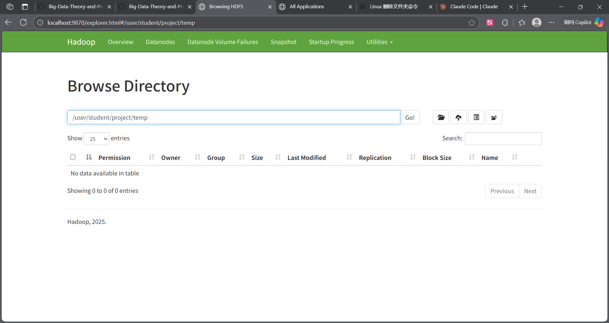

---
