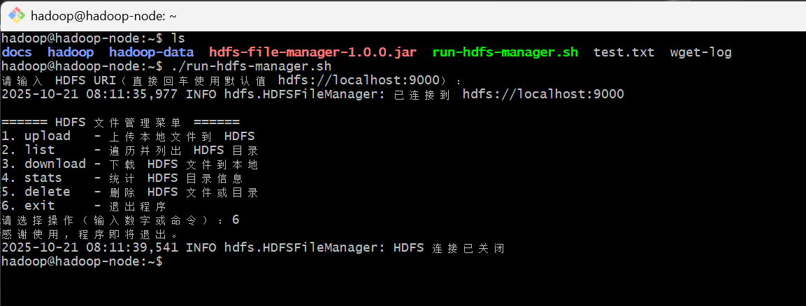
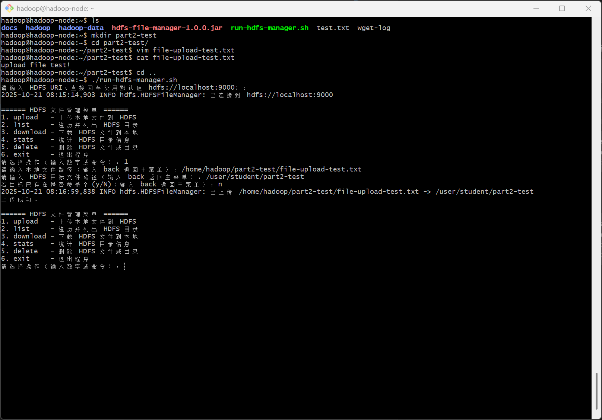
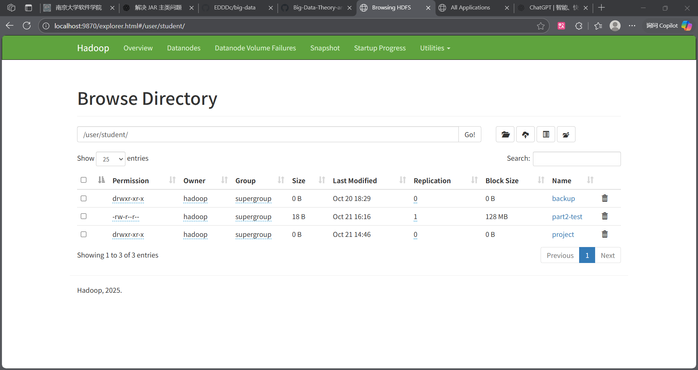
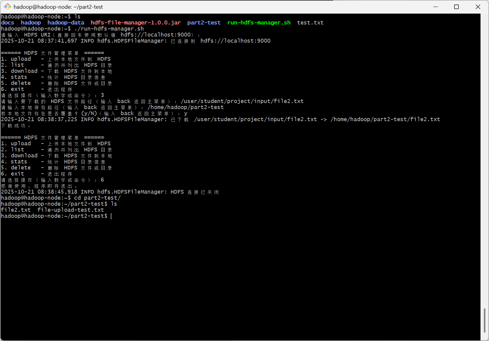
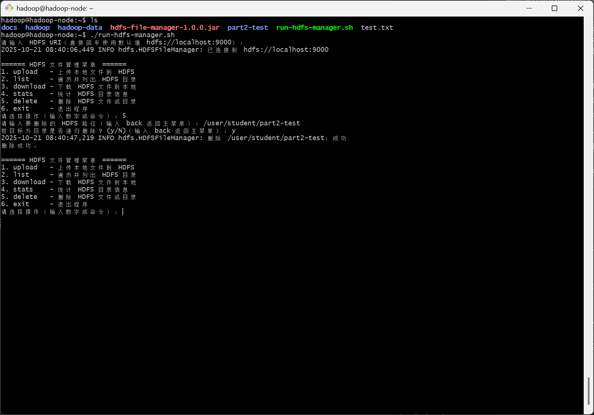
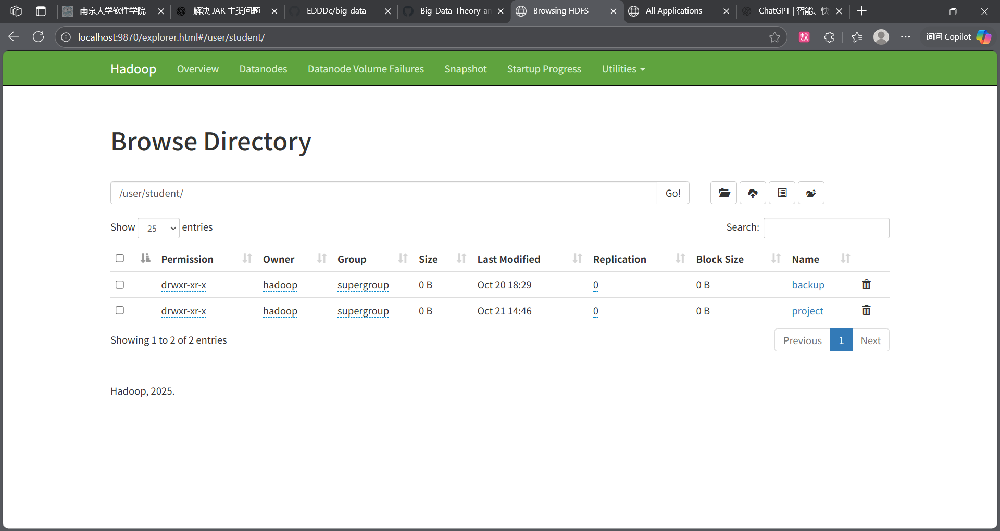
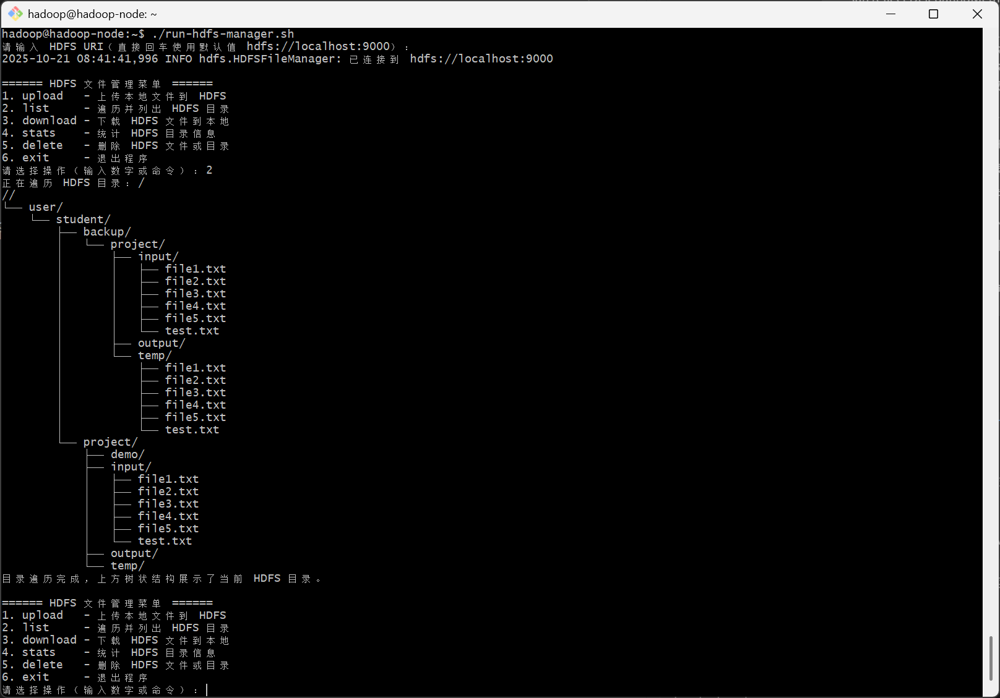

## 第二部分：编程能力评估（5 分）

### 任务 1：HDFS 文件管理器开发

**任务描述**：使用 Java SDK 开发一个 HDFS 文件管理器，实现基本的文件操作功能，并通过 Web UI 验证程序执行效果。

#### 功能要求

开发一个名为 `HDFSFileManager` 的 Java 类，实现以下功能：
1. **连接管理**：建立和关闭 HDFS 连接
2. **文件上传**：将本地文件上传到 HDFS
3. **文件下载**：从 HDFS 下载文件到本地
4. **文件删除**：删除 HDFS 中的文件或目录
5. **目录遍历**：递归列出目录中的所有文件和子目录
6. **目录统计**：统计目录中的文件数量、目录数量和总大小

#### Web UI 验证要求

- 在 NameNode Web UI 中确认程序执行的主要操作结果（如文件上传、目录创建等）。
- 1.连接管理

- 2.文件上传
    - 命令执行
    
    - 确认上传
    
- 3.文件下载
    - 命令执行
    
- 4.文件删除
    - 命令执行
    
    - 确认删除
    
- 5.目录遍历
    - 命令执行
    
- 6.目录统计
    - 命令执行
    
