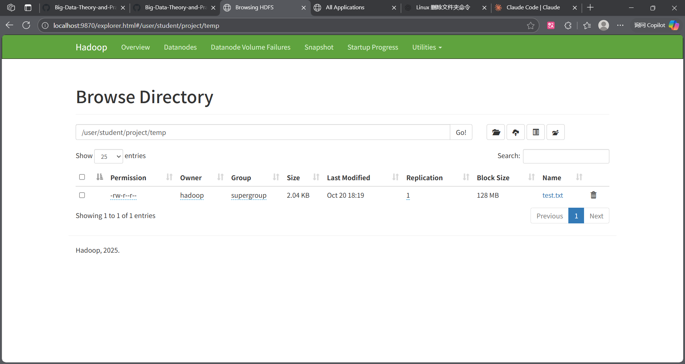
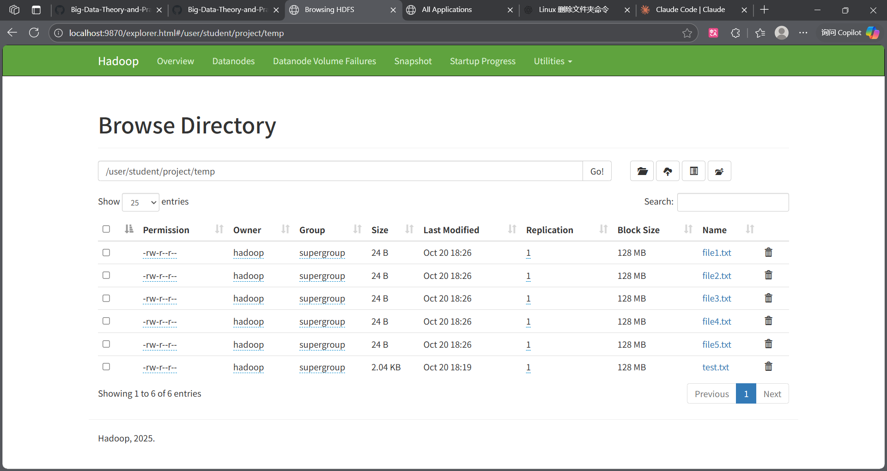

# 练习一：HDFS 常见操作

## 习题说明

本习题旨在全面评估学生对 HDFS 常见操作的掌握程度，包括命令行操作和 Java SDK 编程。习题分为两个部分，每部分都有明确的评分标准和完成要求。

### 环境要求

- Hadoop 3.3.x 单节点伪分布式集群
- Java 8 或更高版本
- Maven 3.6 或更高版本
- 充足的磁盘空间（至少 2GB 可用空间）
- NameNode Web UI 可访问（http://localhost:9870/）

---

## 第一部分：基础操作评估（5 分）

### 任务 1：目录和文件管理

**任务描述**：使用 HDFS 命令行工具完成以下操作，并通过 NameNode Web UI 确认结果。

#### 1.1 目录结构创建

```bash
# 要求：创建以下目录结构：
# /user/student/project/
# ├── input/
# ├── output/
# └── temp/
```

命令执行截图：


**Web UI 验证要求**：
- 在 NameNode Web UI 中确认目录结构创建成功。


#### 1.2 文件上传和管理

```bash
# 要求：
# 1. 在本地创建一个测试文件 test.txt（包含至少 100 行数据）
# 2. 上传至 /user/student/project/input/ 目录
# 3. 查看文件内容的前 10 行和后 10 行
# 4. 查看文件的详细属性信息
```

命令执行截图：


**Web UI 验证要求**：
- 在 Web UI 中确认文件上传成功。


#### 1.3 文件操作和权限管理

```bash
# 要求：
# 1. 将 input 目录中的文件复制到 temp 目录
# 2. 修改 temp 目录中文件的权限为 644
# 3. 修改 temp 目录的权限为 755
# 4. 验证权限设置是否正确
```

命令执行截图：


**Web UI 验证要求**：
- 在 Web UI 中确认文件复制和权限设置成功。
- 目录权限截图：
- 文件权限截图：

### 任务 2：批量操作

**任务描述**：使用 HDFS 命令行工具完成批量文件操作。

#### 2.1 批量文件上传

```bash
# 要求：
# 1. 在本地创建 5 个不同的文件（file1.txt 至 file5.txt）
# 2. 批量上传这些文件到 /user/student/project/input/
# 3. 使用通配符验证所有文件都已上传成功
```

命令执行截图：


**Web UI 验证要求**：
- 在 Web UI 中确认所有文件都已批量上传成功。


#### 2.2 通配符操作

```bash
# 要求：
# 1. 使用通配符列出所有 .txt 文件
# 2. 使用通配符复制所有以 "file" 开头的文件到 temp 目录
# 3. 统计 input 目录中文件的总数
```

命令执行截图：


**Web UI 验证要求**：
- 在 Web UI 中确认通配符操作结果正确。


#### 2.3 目录操作和清理

```bash
# 要求：
# 1. 创建一个备份目录 /user/student/backup/
# 2. 将整个 project 目录复制到 backup 目录
# 3. 删除 temp 目录中的所有文件（保留目录）
# 4. 验证操作结果
```

命令执行截图：


**Web UI 验证要求**：
- 在 Web UI 中确认备份和清理操作成功。
- 备份结果截图：
- temp 目录清理截图：

---

## 第二部分：编程能力评估（5 分）

### 任务 1：HDFS 文件管理器开发

**任务描述**：使用 Java SDK 开发一个 HDFS 文件管理器，实现基本的文件操作功能，并通过 Web UI 验证程序执行效果。

#### 功能要求

开发一个名为 `HDFSFileManager` 的 Java 类，实现以下功能：
1. **连接管理**：建立和关闭 HDFS 连接
2. **文件上传**：将本地文件上传到 HDFS
3. **文件下载**：从 HDFS 下载文件到本地
4. **文件删除**：删除 HDFS 中的文件或目录
5. **目录遍历**：递归列出目录中的所有文件和子目录
6. **目录统计**：统计目录中的文件数量、目录数量和总大小

#### 代码框架

```java
package com.bigdata.hdfs;

import org.apache.hadoop.conf.Configuration;
import org.apache.hadoop.fs.*;
import org.apache.hadoop.io.IOUtils;
import org.slf4j.Logger;
import org.slf4j.LoggerFactory;

import java.io.*;
import java.net.URI;

/**
 * HDFS 文件管理器
 * 提供基本的 HDFS 文件操作功能
 */
public class HDFSFileManager {
    private static final Logger logger = LoggerFactory.getLogger(HDFSFileManager.class);

    private FileSystem fileSystem;
    private Configuration configuration;

    /**
     * 构造函数，初始化 HDFS 连接
     * @param hdfsUri HDFS 的 URI，例如 "hdfs://localhost:9000"
     */
    public HDFSFileManager(String hdfsUri) throws IOException {
        // TODO: 实现构造函数
        // 1. 创建 Configuration 对象
        // 2. 设置 HDFS URI
        // 3. 获取 FileSystem 实例
    }

    /**
     * 上传本地文件到 HDFS
     * @param localPath 本地文件路径
     * @param hdfsPath HDFS 目标路径
     * @param overwrite 是否覆盖已存在的文件
     * @return 上传是否成功
     */
    public boolean uploadFile(String localPath, String hdfsPath, boolean overwrite) {
        // TODO: 实现文件上传功能
        // 1. 检查本地文件是否存在
        // 2. 创建 HDFS 目标目录（如果不存在）
        // 3. 执行文件上传
        // 4. 处理异常情况
        return false;
    }

    /**
     * 从 HDFS 下载文件到本地
     * @param hdfsPath HDFS 文件路径
     * @param localPath 本地目标路径
     * @param overwrite 是否覆盖已存在的文件
     * @return 下载是否成功
     */
    public boolean downloadFile(String hdfsPath, String localPath, boolean overwrite) {
        // TODO: 实现文件下载功能
        return false;
    }

    /**
     * 删除 HDFS 中的文件或目录
     * @param hdfsPath HDFS 路径
     * @param recursive 是否递归删除（用于目录）
     * @return 删除是否成功
     */
    public boolean deleteFile(String hdfsPath, boolean recursive) {
        // TODO: 实现文件删除功能
        return false;
    }

    /**
     * 递归列出目录中的所有文件和子目录
     * @param hdfsPath HDFS 目录路径
     * @param depth 当前递归深度（用于格式化输出）
     */
    public void listDirectory(String hdfsPath, int depth) {
        // TODO: 实现目录遍历功能
        // 1. 检查路径是否存在
        // 2. 获取目录内容
        // 3. 递归处理子目录
        // 4. 格式化输出结果
    }

    /**
     * 统计目录信息
     * @param hdfsPath HDFS 目录路径
     * @return DirectoryStats 对象，包含统计信息
     */
    public DirectoryStats getDirectoryStats(String hdfsPath) {
        // TODO: 实现目录统计功能
        return null;
    }

    /**
     * 关闭 HDFS 连接
     */
    public void close() {
        // TODO: 实现资源清理
    }

    /**
     * 目录统计信息类
     */
    public static class DirectoryStats {
        private long fileCount;
        private long directoryCount;
        private long totalSize;

        // TODO: 实现构造函数、getter 和 toString 方法
    }

    /**
     * 主方法，用于测试 HDFS 文件管理器
     */
    public static void main(String[] args) {
        HDFSFileManager manager = null;
        try {
            // TODO: 实现完整的测试流程
            // 1. 创建 HDFSFileManager 实例
            // 2. 测试文件上传功能
            // 3. 测试目录遍历功能
            // 4. 测试文件下载功能
            // 5. 测试目录统计功能
            // 6. 测试文件删除功能

        } catch (Exception e) {
            logger.error("程序执行出错", e);
        } finally {
            if (manager != null) {
                manager.close();
            }
        }
    }
}
```

#### Maven 配置

创建 `pom.xml` 文件：
```xml
<?xml version="1.0" encoding="UTF-8"?>
<project xmlns="http://maven.apache.org/POM/4.0.0"
         xmlns:xsi="http://www.w3.org/2001/XMLSchema-instance"
         xsi:schemaLocation="http://maven.apache.org/POM/4.0.0
         http://maven.apache.org/xsd/maven-4.0.0.xsd">
    <modelVersion>4.0.0</modelVersion>

    <groupId>com.bigdata</groupId>
    <artifactId>hdfs-file-manager</artifactId>
    <version>1.0.0</version>
    <packaging>jar</packaging>

    <properties>
        <maven.compiler.source>8</maven.compiler.source>
        <maven.compiler.target>8</maven.compiler.target>
        <hadoop.version>3.3.4</hadoop.version>
    </properties>

    <dependencies>
        <!-- Hadoop Client -->
        <dependency>
            <groupId>org.apache.hadoop</groupId>
            <artifactId>hadoop-client</artifactId>
            <version>${hadoop.version}</version>
        </dependency>

        <!-- SLF4J Logging -->
        <dependency>
            <groupId>org.slf4j</groupId>
            <artifactId>slf4j-api</artifactId>
            <version>1.7.36</version>
        </dependency>

        <dependency>
            <groupId>ch.qos.logback</groupId>
            <artifactId>logback-classic</artifactId>
            <version>1.2.12</version>
        </dependency>
    </dependencies>
</project>
```

#### Web UI 验证要求

- 在 NameNode Web UI 中确认程序执行的主要操作结果（如文件上传、目录创建等）。

---

## 提交要求

### 提交内容

1. **第一部分**：命令执行
   - 主要命令的执行截图
   - 简单的 Web UI 验证截图（可选）

2. **第二部分**：Java HDFS 操作
   - 完整的 Java 项目文件
   - 程序运行截图和输出结果

### 提交格式

- 邮件标题：“2025 大数据理论与实践-学号-姓名-练习一”
- 邮箱地址：`grissom.wang@transwarp.io`
- 邮件附件：`学号-practise1` 的压缩包
  - 文件夹：`学号-practise1`
  - 按部分组织子文件夹：`part1`、`part2`
  - 包含一个总体 `README.md` 文件，说明完成情况和遇到的问题
